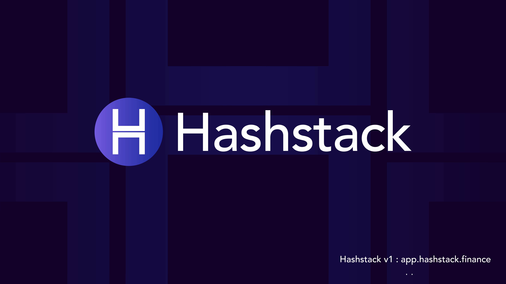

# HSTK Token Documentation

## Overview

HSTK Token is an ERC20-compliant token implementation built on the Ethereum blockchain. The token includes advanced features such as pausability, blacklisting functionality, and controlled token supply management.

## Token Details
- **Address**: 0xF38774A034F5F533D7F9E2ba6b7f3a7542714fA9
- **Name**: Hashstack
- **Symbol**: HSTK
- **Decimals**: 18
- **Maximum Supply**: 9,000,000,000 HSTK (9 billion tokens)
- **Initial Supply**: 1 HSTK (minted to multisig address)

## Features

### Core Functionality
- Standard ERC20 transfer and approval mechanisms
- Minting and burning capabilities
- Token recovery functionality for accidentally sent tokens

### Security Features
1. **Pausability**
   - Full pause/unpause functionality
   - Partial pause state for granular control
   - Affects transfer and approval operations

2. **Blacklisting**
   - Ability to restrict specific addresses from token operations
   - Applies to transfers, approvals, and minting

3. **MultiSig Control**
   - Administrative functions restricted to multisig wallet
   - Enhanced security for critical operations

## Administrative Functions

### Token Management
- `mint(address account, uint256 value)`: Create new tokens up to max supply
- `burn(address account, uint256 value)`: Destroy existing tokens
- `recoverToken(address asset, address to)`: Recover accidentally sent ERC20 tokens

## Security Considerations

1. **Access Control**
   - Blacklisting provides additional control over token movement

2. **Supply Management**
   - Hard cap on maximum token supply
   - Controlled minting process
   - Burning capability for supply reduction

3. **Emergency Controls**
   - Pause mechanism for emergency situations
   - Partial pause for granular control
   - Token recovery function for emergency fund retrieval
