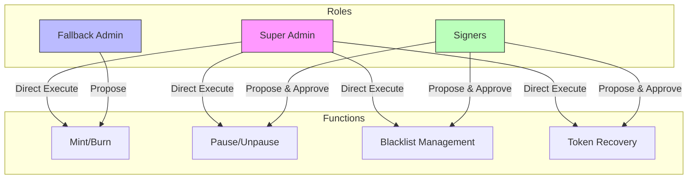
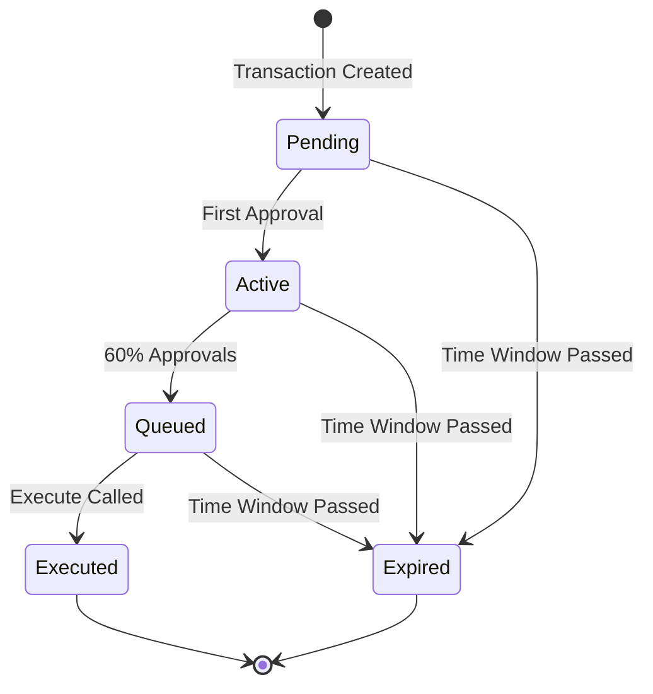
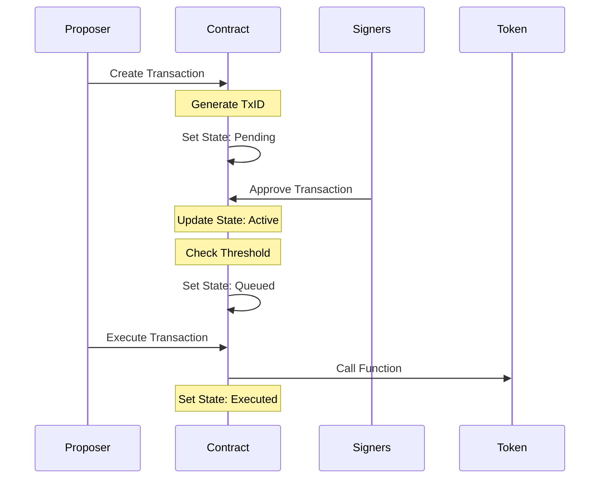

# MultisigWallet Smart Contract Documentation

## Overview

The MultisigWallet is a sophisticated smart contract implementing a multi-signature wallet system with three distinct roles and configurable approval thresholds. It's designed to manage token operations securely through a distributed approval process.

## Key Features

- Three-tier role system (Super Admin, Fallback Admin, Signers)
- Configurable approval threshold (default 60%)
- Time-bounded transaction windows
- Transaction state management
- Support for token operations (mint, burn, pause, etc.)
- Blacklist management capabilities
- Token recovery functionality
- Upgradeable design (UUPS pattern)

## Role Hierarchy

1. **Super Admin**
   - Can execute any function directly
   - Controls contract upgrades
   - Highest privilege level

2. **Fallback Admin**
   - Can initiate mint/burn operations
   - Requires signer approval
   - 72-hour transaction window

3. **Signers**
   - Can initiate and must approve all other functions
   - 24-hour transaction window
   - Requires 60% consensus for execution

## System Architecture

### Role Hierarchy Diagram




### Transaction State Flow




### Transaction Sequence




## Transaction States

1. **Pending**: Just created, awaiting first signature
2. **Active**: Has at least one signature, within time window
3. **Queued**: Has enough signatures, ready for execution
4. **Expired**: Time window passed without enough signatures
5. **Executed**: Successfully executed

## Function Permissions

### Fallback Admin Functions
- `mint(address,uint256)`
- `burn(address,uint256)`

### Signer Functions
- `pause()`
- `unpause()`
- `blacklistAccount(address)`
- `removeBlacklistedAccount(address)`
- `recoverToken(address,address)`

## Time Windows

- **Signer Window**: 24 hours
- **Fallback Admin Window**: 72 hours
- **Approval Threshold**: 60% of total signers

## Setup and Initialization

```solidity
function initialize(
    address _superAdmin,
    address _fallbackAdmin,
    address _tokenContract
) external initializer
```

## Core Functions

### Transaction Creation
```solidity
function createTransaction(bytes4 _selector, bytes memory _params) internal returns (uint256 txId)
```

### Transaction Approval
```solidity
function approveTransaction(uint256 txId) external
```

### Transaction Execution
```solidity
function executeTransaction(uint256 txId) external
```

### Transaction Revocation
```solidity
function revokeTransaction(uint256 txId) external
```

## Events

- `TransactionProposed(uint256 indexed txId, address proposer, uint256 proposedAt)`
- `TransactionApproved(uint256 indexed txId, address signer)`
- `TransactionRevoked(uint256 indexed txId, address revoker)`
- `TransactionExecuted(uint256 indexed txId)`
- `TransactionExpired(uint256 indexed txId)`
- `TransactionStateChanged(uint256 indexed txId, TransactionState newState)`
- `InsufficientApprovals(uint256 indexed txId, uint256 approvals)`

## Error Handling

- `UnauthorizedCall()`
- `InvalidToken()`
- `InvalidState()`
- `AlreadyApproved()`
- `TransactionNotSigned()`
- `WindowExpired()`
- `TransactionAlreadyExist()`
- `TransactionIdNotExist()`

## Security Considerations

1. Time-bounded transactions prevent stale approvals
2. Role-based access control ensures proper authorization
3. Transaction state management prevents invalid executions
4. Upgradeable design allows for future improvements
5. Zero-address checks on critical operations